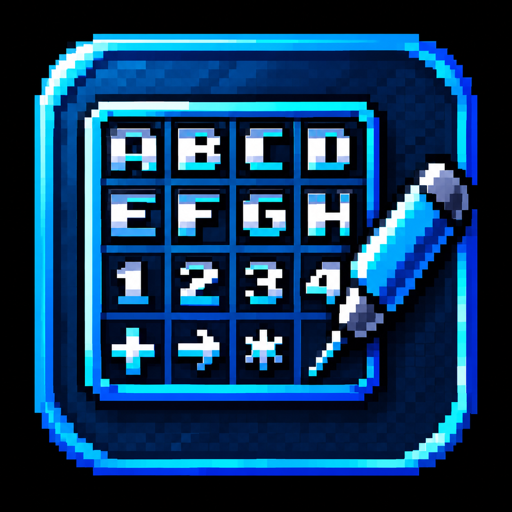

RU
# OpenBOR Font Editor

Редактор растровых шрифтов, созданный специально для игр на движке **OpenBOR**.

## Что это

OpenBOR Font Editor — это утилита, которая позволяет создавать и редактировать
шрифты в формате спрайт-листа (bitmap font). Программа понимает стандарт
шрифтов OpenBOR (ячейка 16×16, порядок символов по ASCII), а также любые
другие раскладки: размер ячейки, код первого символа и интервал настраиваются
вручную прямо в интерфейсе.

## Возможности

- **Загрузка изображений** форматов PNG, GIF, BMP, JPG.
- **Drag&Drop** — перетащите файл прямо в окно программы.
- **Живой предпросмотр** — текст рисуется тем шрифтом, который вы редактируете.
- **Встроенный графический редактор** с инструментами:
  - Карандаш (Pencil)
  - Ластик (Eraser)
  - Заливка (Flood fill)
  - Пипетка (Color picker)
  - Палитра 24 цвета + прозрачный
  - Undo (Ctrl+Z, до 15 шагов)
- **Сохранение** в индексированные форматы (8-бит + палитра):
  - PNG (через libpng)
  - GIF
  - PCX (собственная RLE-реализация)
- **Автоматическое определение фона** — магические пиксели (магента 255,0,255)
  и цвет верхнего левого угла превращаются в прозрачные.
- **Два языка** — русский и английский, переключение по клавише **L**.
- **Кириллица в путях** — используется WinAPI `GetOpenFileNameW`.
- **Контекстное меню** — ПКМ для быстрого доступа к Открыть / Сохранить / Выход.

## Управление

| Клавиши | Действие |
|---|---|
| Ctrl+O | Открыть изображение |
| Ctrl+S | Сохранить как индексированный PNG |
| Ctrl+Shift+S | Сохранить как GIF |
| Ctrl+Alt+S | Сохранить как PCX |
| F1 / F2 | Ширина символа −/+ |
| F3 / F4 | Высота символа −/+ |
| F5 / F6 | Код первого символа −/+ |
| F7 / F8 | Масштаб отображения −/+ |
| F9 / F10 | Интервал между символами −/+ |
| L | Сменить язык (RU / EN) |
| T | Окно ввода тестового текста |
| E | Открыть графический редактор (Paint) |
| H | Справка / О программе |
| ПКМ | Контекстное меню |
| Esc | Закрыть / выход |

### В редакторе (Paint)

| Клавиши | Действие |
|---|---|
| ЛКМ | Рисовать текущим цветом |
| ПКМ | Открыть контекстное меню |
| Alt + ЛКМ | Пипетка |
| Колесо мыши | Зум |
| 1 / 2 / 3 / 4 | Инструмент: карандаш / ластик / заливка / пипетка |
| Ctrl+Z | Отменить действие |
| Enter | Применить изменения |
| Esc | Отменить все изменения этой сессии |

## Шрифты OpenBOR

Движок OpenBOR ожидает шрифт в виде одного изображения-спрайт-листа:

- размер каждой ячейки по умолчанию **16×16 пикселей**;
- символы идут в порядке ASCII, начиная с кода, указанного в поле `first`
  (по умолчанию 0);
- фон должен быть прозрачным — либо через настоящую альфа-канализацию (PNG),
  либо через магический цвет (магента 255,0,255).

Редактор позволяет легко адаптировать готовые спрайт-листы: если размер
ячейки отличается, измените его клавишами F1/F2 (ширина) и F3/F4 (высота).

## Сборка

Требуется MSYS2 MinGW64 и пакеты:
mingw-w64-x86_64-gcc
mingw-w64-x86_64-pkgconf
mingw-w64-x86_64-SDL2
mingw-w64-x86_64-SDL2_image
mingw-w64-x86_64-SDL2_ttf
mingw-w64-x86_64-libpng

text

Сборка:

```bash
./build.sh
Готовый exe появится в build/OBOR_Fonts.exe вместе со всеми DLL.

Автор
MKLIUKANG1 — автор идеи и создатель редактора.

Лицензия
Проект распространяется свободно, используйте на своё усмотрение.
Сторонние библиотеки (SDL2, SDL2_image, SDL2_ttf, libpng) сохраняют свои
собственные лицензии.

En -
OpenBOR Font Editor
A bitmap font editor designed specifically for games built on the
OpenBOR engine.

Overview
OpenBOR Font Editor lets you create and edit bitmap fonts stored as
sprite sheets. It understands the OpenBOR standard (16×16 cells, ASCII
character order) and can also work with any other layout — cell size,
first character code and spacing are all adjustable in the UI.

Features
Load images in PNG, GIF, BMP or JPG format.

Drag&Drop — just drop a file into the window.

Live preview — text is drawn with the font you are editing.

Built-in paint editor with tools:

Pencil

Eraser

Flood fill

Color picker

24-color palette + transparent

Undo (Ctrl+Z, up to 15 steps)

Save to indexed formats (8-bit + palette):

PNG (via libpng)

GIF

PCX (custom RLE implementation)

Automatic background detection — magic pixels (magenta 255,0,255)
and the top-left corner color become transparent.

Two languages — English and Russian, toggled by L.

Cyrillic file paths supported (WinAPI GetOpenFileNameW).

Context menu — right-click for quick Open / Save / Exit.

Controls
Key	Action
Ctrl+O	Open image
Ctrl+S	Save as indexed PNG
Ctrl+Shift+S	Save as GIF
Ctrl+Alt+S	Save as PCX
F1 / F2	Character width −/+
F3 / F4	Character height −/+
F5 / F6	First character code −/+
F7 / F8	Render scale −/+
F9 / F10	Spacing between characters −/+
L	Toggle language (EN / RU)
T	Test text input dialog
E	Open paint editor
H	Help / About
RMB	Context menu
Esc	Close / quit
OpenBOR font format
OpenBOR expects a font as a single sprite sheet image:

each cell is 16×16 pixels by default;

characters are stored in ASCII order, starting at the code set in the
first field (default 0);

the background must be transparent — either as true alpha channel (PNG)
or via the magic color (magenta 255,0,255).

The editor lets you adapt any existing sprite sheet: if the cell size
differs, change it with F1/F2 (width) and F3/F4 (height).

Build
Requires MSYS2 MinGW64 and the following packages:

text
mingw-w64-x86_64-gcc
mingw-w64-x86_64-pkgconf
mingw-w64-x86_64-SDL2
mingw-w64-x86_64-SDL2_image
mingw-w64-x86_64-SDL2_ttf
mingw-w64-x86_64-libpng
Build:

bash
./build.sh
The compiled exe lands in build/OBOR_Fonts.exe together with all DLLs.

Author
MKLIUKANG1 — original idea and creator.

License
Free to use. Third-party libraries (SDL2, SDL2_image, SDL2_ttf, libpng)
retain their own licenses.
